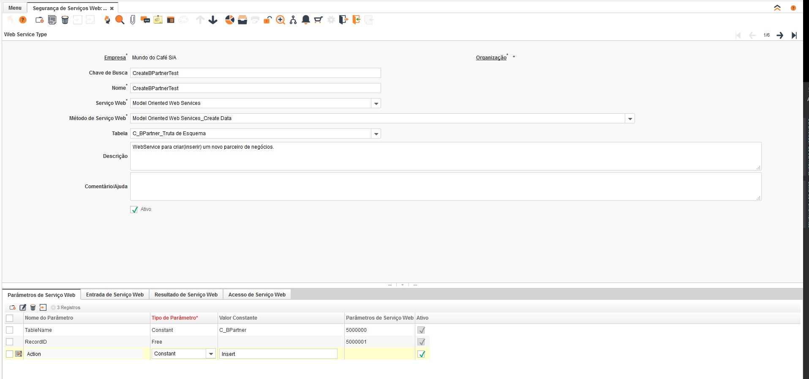

        

O BrERP Web Server Connector tem como objetivo facilitar as requisições SOAP para os webservices do BrERP em sua aplicação .NET. Com sua arquitetura model oriented, não é necessário tratar os arquivos  XML de request e response manualmente. Desta forma, com o auxílio desta biblioteca, é possível realizar facilmente tarefas como:

  - CRUDs, em qualquer tabela do sistema;
  - Extrair informações de views;
  - Executar Doc Actions em qualquer documento do BrERP;
  - Executar processos.

# Documentação

## Exemplo prático: Criando um parceiro de negócios

Esse repositório conta com uma solução C#, utilizando o framework .NET 4.5, que possui dois projetos:
  - **brerpwsc**:
    - Este projeto compila uma biblioteca de sistema (dll), que implementa todos os métodos necessários para fazer a comunicação entre sua aplicação e os Web Services do BrERP;
  - **sandbox**:
    - Este projeto possui algumas classes que empregam a dll **brerpwsc-dotnet** para realizar requisições nos Web Services do BrERP. Tem como função servir de exemplo para as classes de sua aplicação.

No entanto, primeiramente, é necessário configurar o WebService no BrERP.

### Configurando Webservice no BrERP

Para exportar ou importar dados no BrERP, nenhuma linha de  código precisa ser escrita. Basta que sejam feitas algumas simples configurações na janela de *Segurança de Serviços Web*.

#### Segurança de Serviços Web
Quando dizemos que os webservices são model oriented, isso quer dizer que eles são orientados a classes de modelo, ou seja, são orientados a tabelas do banco de dados. Também é possível expor processos, que não estão vinculados a nenhuma tabela no sistema, mas na grande maioria das situações os Web Services tem como objetivo adicionar, atualizar ou consultar dados das tabelas do sistema. Neste exemplo, criaremos um **Web Service para adicionar um Parceiro de Negócio**.


Para isso, uma vez na janela de Serviços de Segurança Web, devemos selecionar o valor *Model Oriented Web Services*, no campo Serviço Web. O campo método de serviço web, diz respeito a operação que queremos fazer, se é uma query (pesquisa), insert, update, delete, executar um processo (runProcess), etc. Neste exemplo, utilizaremos  a opção "Insert".
No campo tabela, deve ser selecionada qual a tabela a ser acessada pelo Web Service, em nosso caso, a tabela *C_BParter*. A *Descrição* é um campo voltado para a documentação e identificação do Web Service, bem como o campo *Comentário/Ajuda*


#### Parâmetros de Serviço Web
A janela parâmetros de Serviço Web, é uma aba filha da janela  *Serviços de Segurança Web*. Obrigatóriamente para o funcionamento do Web Service, é necessário declarar três parâmetros:
- **TableName**: Parâmetro constante,  no qual é atribuido o nome da tabela do banco dados;
- **RecordID**: Parâmetro free, ou seja, pode ser passado qualquer valor na requisição;
- **Action**: Parâmetro constante e contém o tipo de operação que o Web Service realizará no banco de dados. Como em nosso exemplo iremos *inserir* um *Parceiro de Negócios*, seu valor será **Insert**.


#### Entrada de Serviço Web
É onde devemos informar quais colunas da tabela terão dados inseridos ou modificados pelo WebService. Em nosso caso, utilizaremos as colunas basicas necessárias para cadastrar um *Parceiro de Negócios*


#### Resultado de Serviço Web
São as colunas que terão dados retornados pelo Web Service. Como nosso Web Service nesse exemplo é para a criação e não para a consulta, não adicionaremos dados nessa janela.

#### Acesso de Serviço Web
São os perfis que tem permissão para fazer essa requisição. Lembrando que, no BrERP, toda requisição necessita ser autenticada (Login).

Segue abaixo, o print do Web Service configurado:
Mundo do Café S/A Admin


Uma vez configurado nosso Web Service para criação de Parceiro de Negócios no BrERP, podemos desenvolver uma simples aplicação, utilizando a biblioteca **brerpwsc-dotnet**, para interagir com ele.

## Código C# 

```c#
using System;
using WebService.Base;
using WebService.Request;
using WebService.Response;
using WebService.Net;
using WebService.Base.Enums;

namespace sandbox
{
    class CreateBusinessPartner
    {
        public static LoginRequest GetLogin()
        {
            LoginRequest login = new LoginRequest
            {

                //Subistitua com suas informações

                User = "superuser @ brerp.com.br",
                Pass = "Sua Senha Aqui",
                ClientID = 1000000,
                RoleID = 1000000,
                WarehouseID = 5000007,
                OrgID = 5000003,
            };
            return login;
        }

        public static string GetUrlBase()
        {
            return "https://teste.brerp.com.br/";
        }


        public static WebServiceConnection GetClient()
        {
            WebServiceConnection client = new WebServiceConnection
            {
                Attempts = 3,
                Timeout = 5000,
                AttemptsTimeout = 5000,
                Url = GetUrlBase(),
                AppName = "Atualizando parceiro de negócio",
            };
            return client;
        }

        public static void Main(string[] args)
        {
            //Cria uma operação do tipo create (vamos inserir um BP no sistema)
            CreateDataRequest createBpartner = new CreateDataRequest
            {
                WebServiceType = "CreateBPartnerTest",
                //Pega as informações de login
                Login = GetLogin()
            };

            //Passa os dados do registro a ser inserido
            DataRow data = new DataRow();
            data.AddField("Value", "TESTING3");
            data.AddField("Name", "Pedro Pozzi Ferreira");
            data.AddField("Name2", "pozzisan");
            data.AddField("Description", "Criado por brerpwsc-dotnet: " + DateTime.Now);
            data.AddField("TaxID", null);
            data.AddField("Logo_ID", null);
            createBpartner.DataRow = data;
            // Pega as inforamções da conexão
            WebServiceConnection client = GetClient();

            try
            {
                //Envia a operação, que nesse caso é um criar, e armazena a resposta enviada pelo server
                StandardResponse response = client.SendRequest(createBpartner);

                Console.WriteLine("XML Enviado ao Servidor");
                client.WriteRequest(Console.Out);
                Console.WriteLine();
                Console.WriteLine("XML De Resposta Do Servidor\n");
                client.WriteResponse(Console.Out);
                Console.WriteLine();

                // Verifica se ocorreu algum erro ao executar a operação e exibe o erro
                if (response.Status == WebServiceResponseStatus.Error)
                {
                    Console.WriteLine(response.ErrorMessage);
                    Console.WriteLine(response.GetErrorType());
                }

                Console.WriteLine("--------------------------");
                Console.WriteLine("Web Service: CreateBPartnerTest");
                Console.WriteLine("Attempts: " + client.AttemptsRequest);
                Console.WriteLine("Time: " + client.TimeRequest);
                Console.WriteLine("--------------------------");
            }
            catch (Exception e)
            {
                Console.WriteLine(e.ToString());
            }
        }
    }
    }

```
## Console Output

```xml
XML Enviado ao Servidor

<?xml version="1.0" encoding="ibm850"?>
<soapenv:Envelope xmlns:_0="http://idempiere.org/ADInterface/1_0" xmlns:soapenv="http://schemas.xmlsoap.org/soap/envelope/">
  <soapenv:Header />
  <soapenv:Body>
    <_0:createData>
      <_0:ModelCRUDRequest>
        <_0:ModelCRUD>
          <_0:serviceType>CreateBPartnerTest</_0:serviceType>
          <_0:DataRow>
            <_0:field column="Value">
              <_0:val>TESTING2</_0:val>
            </_0:field>
            <_0:field column="Name">
              <_0:val>Pedro Pozzi Ferreira</_0:val>
            </_0:field>
            <_0:field column="Name2">
              <_0:val>pozzisan</_0:val>
            </_0:field>
            <_0:field column="Description">
              <_0:val>Criado por brerpwsc-dotnet: 10/12/2018 16:30:38</_0:val>
            </_0:field>
            <_0:field column="TaxID" />
            <_0:field column="Logo_ID" />
          </_0:DataRow>
        </_0:ModelCRUD>
        <_0:ADLoginRequest>
          <_0:user>superuser @ brerp.com.br</_0:user>
          <_0:pass>Sua Senha Aqui</_0:pass>
          <_0:ClientID>1000000</_0:ClientID>
          <_0:RoleID>1000000</_0:RoleID>
          <_0:OrgID>5000003</_0:OrgID>
          <_0:WarehouseID>5000007</_0:WarehouseID>
        </_0:ADLoginRequest>
      </_0:ModelCRUDRequest>
    </_0:createData>
  </soapenv:Body>
</soapenv:Envelope>XML De Resposta Do Servidor

<?xml version="1.0" encoding="ibm850"?>
<soap:Envelope xmlns:soap="http://schemas.xmlsoap.org/soap/envelope/">
  <soap:Body>
    <ns1:createDataResponse xmlns:ns1="http://idempiere.org/ADInterface/1_0">
      <StandardResponse xmlns="http://idempiere.org/ADInterface/1_0" RecordID="5000051">
      </StandardResponse>
    </ns1:createDataResponse>
  </soap:Body>
</soap:Envelope>--------------------------
Web Service: CreateBPartnerTest
Attempts: 1
Time: 1016
--------------------------
```

# Resultado

Após executar esta simples aplicação, procurarmos pelo Parceiro de Negócio, notaremos que o mesmo foi criado com sucesso:


